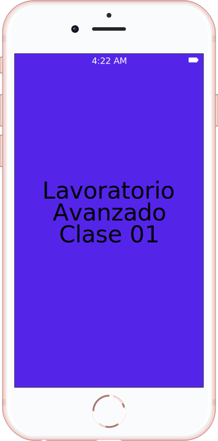
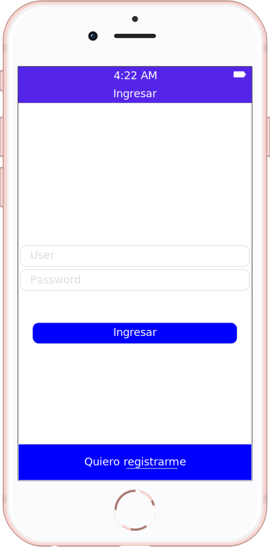
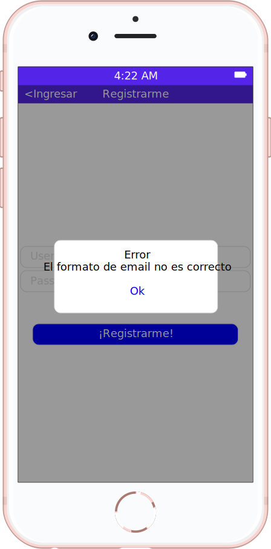

# Laboratorio 1

* Los botones de ingresar y registrarse se muestra solo si los dos campos no están vacíos.
* Si toco ingresar muestro un alerta comunicando que el usuario quiere ingresar.
* Si toco “¡registrarme!” y el email no tiene formato correcto, muestro un alerta comunicando que el email está mal escrito. Si el email está ok, muestro un alerta comunicando que el usuario se quiere registrar.

{:height="400px" width="auto"}  {:height="400px" width="auto"}  {:height="400px" width="auto"}
